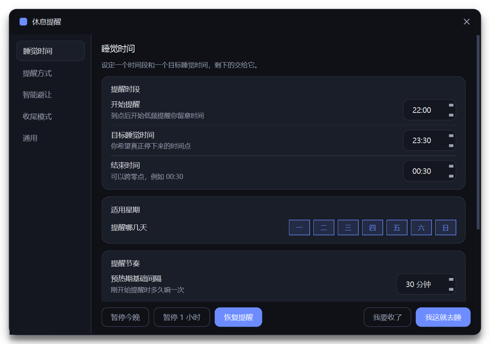

# 休息提醒 RestReminder

一个晚上提醒你「到点就停」的 Windows 小工具。目标是早睡，不是专注或番茄钟 ——
时间到了会反复提醒，强度一路堆到你**真的离开电脑**为止，中途不给你「今天别再提醒」这种台阶下。



- 绿色免安装：只有一个 exe，双击就能用
- 不写注册表、不要管理员权限、不联网、无遥测
- 已在 Windows 11 专业版 25H2 上验证

---

## 快速开始

1. 把 `RestReminder.exe` 放到任意目录（桌面、D 盘都行）
2. 双击运行，右下角托盘会出现一个月亮图标
3. 首次运行会自动打开设置窗口，先设好**开始提醒时间**和**目标睡觉时间**
4. 关掉设置窗口即可，程序在后台运行

配置会生成在 exe 同目录的 `config.json`。如果那个目录不可写（只读介质、Program Files），
会自动改用 `%APPDATA%\RestReminder\`。

---

## 它到底怎么提醒你

默认配置是「22:00 开始提醒、23:30 目标睡觉、00:30 结束」，行为分三个阶段：

| 阶段 | 时间 | 行为 |
|---|---|---|
| 预热期 | 22:00 起 | 每 30 分钟左右一条角落轻提醒，3 秒后自动消失，不打断你 |
| 收紧期 | 距睡觉 45 分钟内 | 间隔逐步压缩，升到中央弹窗，显示距目标的倒计时 |
| 超时追踪 | 过了 23:30 | 间隔压到 5 分钟，直接全屏遮罩，没有「永久忽略」选项 |

还有两个细节：

- **提前预告**：距目标 5 分钟时先轻轻说一句，减少突兀感
- **窗口结束后还会追 60 分钟**：如果 00:30 了你还在用电脑，它会继续催一段时间才放弃

### 「再给我 X 分钟」的代价

点「再给我 5 / 15 / 30 分钟」之后：

- 下次间隔**减半**（最多缩短到原来的 1/4）
- 强度**再升一级**
- 同时右下角出现收尾倒计时，时间一到直接进最强提醒

这些叠加，所以拖延是会越来越难拖的。

### 「直到我休息」怎么判定

满足以下任意一条，今晚就结束：

1. 点「我去睡了」
2. 离开电脑超过设定时间（默认 10 分钟，读系统空闲时间，不看摄像头不装驱动）
3. 关机 / 休眠 / 注销

结束后会记一笔，下次启动时告诉你昨晚几点停的、有没有超时。

### 「我去睡了」可以真的把电脑关掉，也可以反悔

在「通用」页把它设成 **自动关机** 后，点下「我去睡了」会发生三件事：

1. 立刻安排一次系统关机，**宽限时间默认 120 秒**（可设 30～900 秒）
2. 右下角出现倒计时卡片，随时可以点 **「取消关机，继续用电脑」**
3. 反悔时会同时做三件事：取消关机、撤销「已休息」状态、清掉刚才记的那一笔，
   提醒照常继续，就像什么都没发生过

关机由系统执行，会正常给各个程序保存文件的机会，也不需要管理员权限。

保持「只记录」的话，就是一个 90 秒内可撤销的确认卡片，完全不动你的电脑。

> **关于关机的两件事**
>
> - 关机是**系统级**排定的。即使程序崩溃或被强杀，到点照样会关机 ——
>   这是刻意的，否则这个功能又会变成摆设。想手动取消，命令行执行 `shutdown /a`。
> - 唯一的例外：你主动从托盘点「退出」程序时，程序会顺手把已排定的关机撤掉
>   （主动退出说明你还没打算睡）。

---

## 「我要收了」：主动触发收尾倒计时

不想等到设定时间，而是此刻就决定要收工？点 **设置窗口底部的「我要收了」**
（或托盘右键里的同名项）。它会按固定节奏催你，**间隔越来越短、强度越来越高**：

| 第几次 | 等多久 | 提醒方式 |
|---|---|---|
| 第 1 次 | 5 分钟 | 角落轻提醒 |
| 第 2 次 | 2 分 30 秒 | 中央弹窗 |
| 第 3 次 | 2 分钟 | 全屏遮罩 |
| 第 4 次及以后 | 每 1 分钟 | 全屏遮罩 |

提醒上有 **三个选项**，主次分明：

| 选项 | 作用 |
|---|---|
| **我已经收了**（主按钮） | 结束收尾，按正常流程记一笔（开了自动关机的话也会走那一套） |
| **延后 5 分钟**（次按钮） | 只是这次先收起来，收尾模式继续跑，过一会儿再来 |
| **结束收尾**（灰色小字） | 退出收尾模式，回到早睡提醒 |

「结束收尾」刻意做得很不显眼 —— 一行灰字，没有边框也没有底色：不挡住你，
但也不会让你顺手一点就过去了。

另外，**离开电脑**超过设定时间，也会自动判定你已经收工。

> 「延后」和早睡里的「再给我 5 分钟」不是一回事：
> 早睡那个会缩短下次间隔、并升级强度（拖延有代价）；
> 收尾里的延后**不缩短间隔，也不升级强度** —— 你已经说了要收尾，
> 只是手头还差一点，不该为这点事被惩罚。

### 在设置里调

侧边栏的 **「收尾模式」** 页专门管这套东西：

- **提醒节奏**：每一档等多久都能改，还能「加一档 / 减一档」（1～6 档）。
  走完最后一档后，会一直用最短的那一档继续催
- **强度渐进**：三选一
  - **从轻到重**：第 1 次轻提醒 → 第 2 次弹窗 → 第 3 次起全屏（默认）
  - **从弹窗开始**：跳过轻提醒，第 2 次就到全屏
  - **直接全屏**：每次都全屏，从第一次就拉满
- **延后时长**：上面那个「延后 5 分钟」里的 5 到底是多少

两件事说明白：

- 收尾模式**不受「提醒时段」限制** —— 什么时间点都能手动开
- 收尾模式的**强度也不受早睡的「强制程度」限制**。「提醒方式 → 强制程度」
  是给自动提醒设的上限（比如设成「温和」就永远不弹全屏）；收尾是你自己主动
  开的，理应允许升到最强。这两套互不影响

---

## 暂停之后想反悔？随时

暂停（托盘右键、设置底部的「暂停今晚 / 暂停 1 小时」、快捷键 `Ctrl+Alt+R`）之后，
右下角会立刻弹出一张卡片，上面就有 **「立即恢复提醒」**。

不只是这个入口：

- 托盘图标右键 → 「恢复提醒」
- 设置窗口底部 → 「恢复提醒」（暂停时才出现）
- 再按一次 `Ctrl+Alt+R`

三条路都能立刻取消暂停，不用去猜怎么回来。

---

## 三种强制程度

在「提醒方式」页里切换：

- **温和**：最高只到中央弹窗，永远不会占用全屏。适合电脑上还挂着别的事
- **标准**（默认）：逐级升级 轻提醒 → 弹窗 → 全屏遮罩
- **硬核**：可以升到全屏遮罩，且跳过或暂停都需要密码，防止自己拖延。
  密码只存在本地配置文件里，不会联网，也不需要任何系统权限（忘了找不回来）

## 智能避让

- **全屏避让**：检测到你正在看视频、打游戏、开视频会议或做演示时自动延后。
  超时阶段不再避让 —— 该睡的时候不管你在干嘛
- **空闲暂停**：键鼠没有任何操作时自动安静，不打扰已经走开的你
- **休眠感知**：睡眠期间不计时，唤醒后重新排期，不会一开机就弹提醒

---

## 界面

- 深色夜晚 / 浅色 / 跟随系统，在「通用」页切换，默认深色
- 全部界面自绘，带淡入淡出、滑块位移、弹簧弹出、呼吸渐入等过渡动效
- 若系统关闭了「显示动画」，程序会自动把动效收掉
- 多显示器：全屏遮罩会同时铺满所有屏幕

## 快捷操作

- **托盘图标右键**：打开设置 / 我这就去睡 / 暂停 1 小时 / 暂停今晚 / 恢复提醒 / 清除痕迹 / 退出
- **全局快捷键**：默认 `Ctrl+Alt+R`，按一下暂停 1 小时，再按一下恢复（可在设置里改）
- **双击托盘图标**：打开设置
- 重复双击 exe 不会开出第二个实例，只会把已有窗口叫出来

---

## 关于「绿色」这件事

| 项目 | 做法 |
|---|---|
| 安装 | 不需要。删掉 exe 就是卸载 |
| 注册表 | 只在**你主动开启开机自启**时创建启动文件夹快捷方式，其余一律不碰 |
| 开机自启 | 默认关闭。开启后在 `%APPDATA%\Microsoft\Windows\Start Menu\Programs\Startup` 放一个快捷方式，资源管理器地址栏输入 `shell:startup` 就能看到它，**直接删掉就等于取消** |
| 权限 | 全程普通用户权限，不申请管理员 |
| 网络 | 不发起任何网络请求 |
| 配置文件 | exe 同目录的 `config.json` |
| 运行日志 | exe 同目录的 `restreminder.log`，超过 512KB 自动轮转一次，不会无限长大 |

设置页「数据与卸载」里有个 **一键清除所有痕迹**：取消自启、删配置、删运行日志、
删临时提示音，一次做完。

---

## 常见问题

**首次运行 Windows 提示「未知发布者」，说 SmartScreen 已阻止**
这是所有未做代码签名的小工具的通病，不是报毒。点「更多信息」→「仍要运行」即可。
想彻底消除需要购买代码签名证书。

**杀毒软件报警**
本程序是 PyInstaller 打包的 Python 应用，这类包偶尔会被某些引擎误报，
属于行业性误报（因为打包器本身常被滥用）。源码就在 `src/` 下，可以自行审阅或重新打包。

**为什么不用系统通知？**
Windows 11 的专注助手 / 勿扰模式会直接吞掉系统 Toast 通知，导致提醒静默失效。
所以这里的「角落轻提醒」是程序自己画的窗口，不受那套开关影响。

**双击了但托盘没图标，程序好像没起来？**
先看程序目录下的 `restreminder.log`（和 `config.json` 放在一起）。每次启动都会记几行，
能直接看出是哪种情况：

- `检测到已有实例，唤起它的设置窗口，本进程退出` —— **正常**。说明程序本来就在运行，
  托盘图标可能是被折叠进「隐藏的图标」里了
- `单实例锁已取得，继续初始化` → `启动完成 | 主题=… ` —— 启动正常
- 出现「未捕获异常」和一段堆栈 —— 这才是真出问题了，把这段贴到 issue 里就行

**提醒没出现？**
按顺序检查：是否在提醒时段内 → 是否处于暂停状态 → 托盘图标是否显示为暂停态 →
是不是刚离开过电脑被判定了已休息 → `restreminder.log` 里有没有异常记录。

**想临时安静一会儿**
托盘右键「暂停 1 小时」或「暂停今晚」，或按 `Ctrl+Alt+R`。

---

## 从源码构建

需要 Python 3.11+（已在 3.13 上验证）。

```bash
pip install PySide6 pyinstaller pillow

# 生成程序图标
python tools/make_icon.py

# 一键验证：编译检查 + 自检(44 项) + 端到端(20 项)
python tools/verify.py

# 也可以单独跑
python tools/selftest.py     # 逻辑、系统能力、界面构建与渲染
python tools/e2e_test.py     # 真实时钟下跑通「配置 → 调度器 → 控制器 → 提醒窗口」

# 直接以源码运行
python src/main.py

# 打包单文件 exe，产物在 dist/RestReminder.exe
python -m PyInstaller --clean --noconfirm rest_reminder.spec
```

### 代码结构

```
src/main.py                    入口，单实例、高 DPI
src/rreminder/
    config.py                  配置读写、路径解析、阶段判定
    theme.py                   深浅两套调色板 + 全局样式表
    winapi.py                  空闲检测、全屏检测、系统偏好、自启管理
    scheduler.py               调度引擎：三阶段、强度升级、休息判定
    assets.py                  代码生成图标与提示音，无外部素材
    hotkey.py                  全局快捷键
    log.py                     运行日志（含未捕获异常堆栈），出问题先看它
    app.py                     控制器，串起所有部件
    ui/
        widgets.py             卡片、动画开关、分段选择器、浮层基类
        alerts.py              角落轻提醒、中央弹窗、收尾倒计时
        overlay.py             多显示器全屏遮罩
        settings_win.py        设置窗口与对话框
        tray.py                托盘与右键菜单
tools/make_icon.py             构建期生成 ico
tools/selftest.py              自检脚本（逻辑 + 系统能力 + 界面渲染）
tools/e2e_test.py              端到端测试（真实时钟下走完整链路）
tools/verify.py                一键验证：编译检查 + 上面两套测试
tools/shot_settings.py         渲染设置页截图，并检查点击后控件是否位移
rest_reminder.spec             PyInstaller 打包配置
```

### 修改默认配置

编辑 `src/rreminder/config.py` 里的 `DEFAULT_CONFIG`，然后重新打包。
`config.py` 顶部的 `DEFAULT_TIPS` 是小贴士文案，可以换成你自己的话。

---

## 许可证

[MIT](LICENSE) © 2026 no-name-yet0

可以自由使用、修改、分发，甚至商用，只要保留版权声明。程序按「现状」提供，
不附带任何担保。
